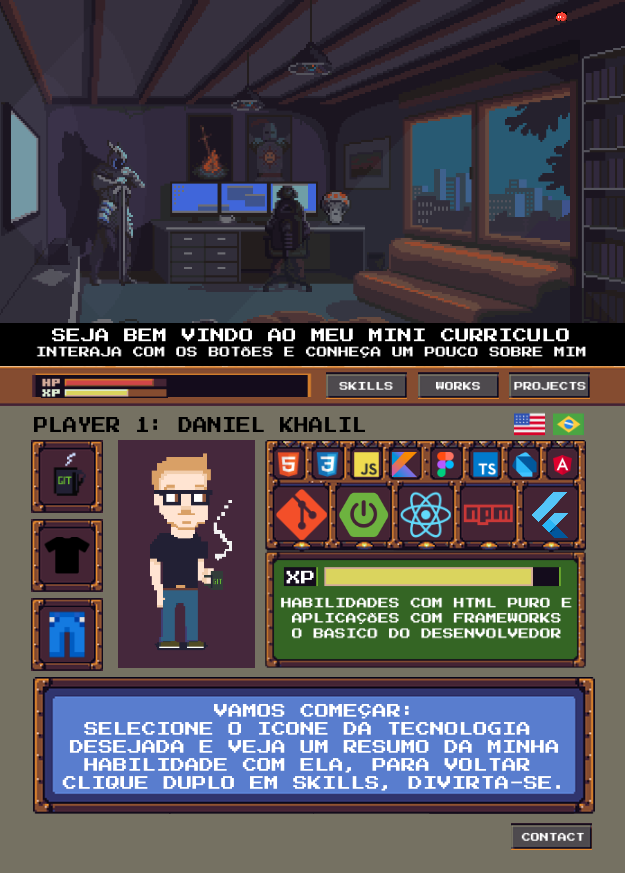

<h1 align="center"> Projeto Currículo Interativo </h1>

  <a href="#-tecnologias">Tecnologias</a>&nbsp;&nbsp;&nbsp;|&nbsp;&nbsp;&nbsp;
  <a href="#-projeto">Projeto</a>&nbsp;&nbsp;&nbsp;|&nbsp;&nbsp;&nbsp;
  <a href="#-layout">Layout</a>&nbsp;&nbsp;&nbsp;|&nbsp;&nbsp;&nbsp;

 

  

## 🚀 Tecnologias

Esse projeto foi desenvolvido com as seguintes tecnologias:

- HTML e CSS
- JavaScript
- [Node e NPM](https://nodejs.org/)
- [Aseprite](https://www.aseprite.org/)
- [ReactJS](https://pt-br.reactjs.org/)
- [Vercel](https://payment-project-omega.vercel.app/)

## 💻 Projeto

Este é meu currículo interativo. Nele você encontra informações sobre meus trabalhos, conhecimentos e experiências no mercado como desenvolvedor. 

## 🔖 Layout

Você pode visualizar o layout do projeto através [DESSE LINK](https://www.figma.com/file/qKsCcIJiGm6jB99LvKokQv/Portfolio-React-PixelArt-(Copy)?node-id=206%3A171). É necessário ter conta no [Figma](https://figma.com) para acessá-lo.
